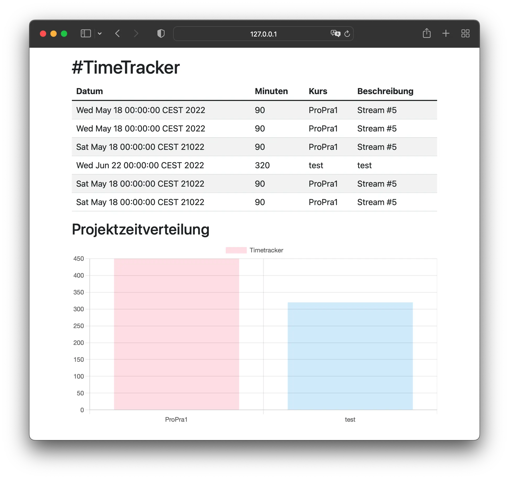

# TimeTracker UI

This generates a static website displaying the contents of the tasks.csv file
provided by https://github.com/hhu-propra1/time-tracker



## Requirements

You need to install [babashka](https://github.com/babashka/babashka#quickstart) and [yarn](https://github.com/yarnpkg/yarn)

## Build index page

Execute the following commands:

    yarn
    bb src/site.clj

Note that you only need to run `yarn` when your package.json changes.

## Development

As our editor, we will work with VS Code:

- [Download VSCode](https://code.visualstudio.com/)
- [Install Calva Plugin](https://marketplace.visualstudio.com/items?itemName=betterthantomorrow.calva) To install, click on the green button ("Install") above.

## Set up editor

We use VS Code or VS Codium with the plugin "Calva" here. Then we start a REPL and connect the editor to it. This works
especially well with an appropriately configured editor, which is why we will take a short
time here.

Here is a short video to start a Babashka REPL in VSCode and to connect the
editor with it. Then we can send the code directly from the editor to the
REPL.

Start by opening `src/site.clj` in your editor. Then start a REPL and connect to it:

### Shortcut Advices

It is especially great if you have a REPL to be able to interact with the code directly from the editor. There are a few keyboard shortcuts for this, which you can
configure them as you like. These are my (@n2o) recommendations:

- `C-c C-c` (Control C, Control C): Evaluates S-Expression (thus sends the
  current code from the cursor to the REPL).
- `C-c C-k`: Loads all the code from the file into the REPL.
- `C-c right`: Moves the closing parenthesis one expression further to the right.
- `C-c left`: Moves the closing parenthesis one expression back to the left.
- `C-c C-d`: If you have accidentally created an endless loop, cancel the last expression with this abbreviation.

To install the shortcuts, open the Keyboard Shortcuts in VSCode under Preferences. In the top right-hand corner you will find an icon with which you can open the configuration file.

There you can add the following entries.

```json
[
  {
    "key": "ctrl+c ctrl+c",
    "command": "calva.evaluateCurrentTopLevelForm",
    "when": "calva:connected"
  },
  {
    "key": "ctrl+c ctrl+d",
    "command": "calva.interruptAllEvaluations",
    "when": "calva:connected"
  },
  {
    "key": "ctrl+c ctrl+k",
    "command": "calva.loadFile",
    "when": "calva:connected"
  },
  {
    "key": "ctrl+c right",
    "command": "paredit.slurpSexpForward",
    "when": "calva:keybindingsEnabled && editorTextFocus && editorLangId == 'clojure' && editorLangId == 'clojure' && paredit:keyMap =~ /original|strict/"
  },
  {
    "key": "ctrl+c left",
    "command": "paredit.barfSexpForward",
    "when": "calva:keybindingsEnabled && editorTextFocus && editorLangId == 'clojure' && editorLangId == 'clojure' && paredit:keyMap =~ /original|strict/"
  }
]
```
